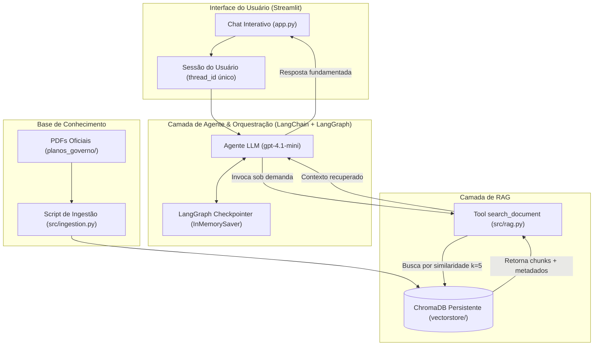

# 🗳️ PoliticAI

> **Assistente de Inteligência Artificial para Consulta e Comparação de Planos de Governo Presidenciais (Brasil 2026)**

O **PoliticAI** é uma aplicação completa de IA Generativa voltada para a análise transparente, neutra e fundamentada de propostas políticas. Utilizando uma arquitetura de **RAG (Retrieval-Augmented Generation)** acoplada a um **Agente Autônomo com memória conversacional**, o sistema permite que cidadãos, pesquisadores e eleitores explorem e comparem as diretrizes governamentais de cada candidato diretamente a partir de seus documentos oficiais em PDF.

---

## 📌 Sumário
- [Visão Geral](#-visão-geral)
- [Funcionalidades Implementadas](#-funcionalidades-implementadas)
- [Arquitetura da Aplicação](#-arquitetura-da-aplicação)
- [Fluxo de Funcionamento](#-fluxo-de-funcionamento)
- [RAG e Memória Conversacional](#-rag-e-memória-conversacional)
- [Tecnologias Utilizadas](#-tecnologias-utilizadas)
- [Estrutura do Projeto](#-estrutura-do-projeto)
- [Guia de Instalação e Execução](#-guia-de-instalação-e-execução)
- [Status Atual](#-status-atual)
- [Próximos Passos](#-próximos-passos)

---

## 🎯 Visão Geral

Nas eleições, os planos de governo submetidos pelos candidatos costumam ser documentos extensos e densos, dificultando a leitura aprofundada pelo eleitor comum. O **PoliticAI** soluciona essa barreira de acessibilidade ao estruturar uma base de conhecimento vetorial a partir dos arquivos oficiais e disponibilizar uma interface conversacional intuitiva.

Toda resposta gerada pelo agente é estritamente ancorada nos fragmentos textuais dos próprios planos de governo, reduzindo drasticamente alucinações e garantindo rastreabilidade das fontes.

---

## ✨ Funcionalidades Implementadas

- **Pipeline de Ingestão e Indexação (ETL)**:
  - Leitura automatizada de múltiplos documentos PDF de candidatos a partir da pasta de dados (`planos_governo/`).
  - Associação dinâmica de metadados com o nome do respectivo candidato extraído do próprio arquivo.
  - Divisão textual inteligente em blocos com sobreposição (`RecursiveCharacterTextSplitter`, com chunk size de 1000 e overlap de 150 caracteres).
  - Geração de representações vetoriais com `text-embedding-3-small` da OpenAI e persistência em banco vetorial local com ChromaDB.
- **Busca Semântica via Tool de RAG**:
  - Ferramenta customizada do LangChain (`search_document`) configurada para realizar busca por similaridade semântica (`k=5`) no banco vetorial persistido.
- **Agente Autônomo Reativo**:
  - Construído com LangChain (`create_agent`) e alimentado pelo modelo `gpt-4.1-mini`.
  - Equipado com `system_prompt` especializado em assistência política neutra e instruído a acionar a ferramenta de busca sob demanda.
- **Memória Conversacional Multi-Turn**:
  - Gerenciamento de histórico de diálogo utilizando o `InMemorySaver` do LangGraph, associando o contexto de mensagens a uma `thread_id` única por sessão.
- **Interface Web Interativa (Chat)**:
  - Desenvolvida com Streamlit, com suporte a histórico visual na tela, identificação de papéis (`user` / `assistant`), e indicador dinâmico de processamento (`st.spinner`).

---

## 🏗️ Arquitetura da Aplicação



---

## 🔄 Fluxo de Funcionamento

O ciclo de vida de uma interação no PoliticAI segue o caminho estruturado:

1. **Entrada do Usuário**: O eleitor digita uma dúvida ou pergunta temática na interface Streamlit (ex: *"Quais são as propostas para a saúde?"*).
2. **Orquestração do Agente**: A aplicação Streamlit envia a mensagem ao agente com o identificador de thread (`thread_id`). O agente analisa a intenção do usuário consultando seu histórico de mensagens salvo no `InMemorySaver`.
3. **Decisão e Chamada de Ferramenta (Tool Call)**: Identificando a necessidade de consultar fatos políticos, o agente aciona a ferramenta `search_document`.
4. **Consulta ao Banco Vetorial (ChromaDB)**: A ferramenta converte a pergunta em embedding vetorial e executa uma busca por similaridade de cosseno nos índices persistidos na pasta `vectorstore/`.
5. **Recuperação de Contexto**: Os 5 fragmentos mais relevantes com metadados do candidato de origem são devolvidos ao agente.
6. **Síntese e Resposta**: O modelo de linguagem sintetiza uma resposta objetiva baseada exclusivamente nos dados retornados, exibida em tempo real para o usuário no chat.

---

## 🧠 RAG e Memória Conversacional

### O que é e por que usar RAG?
Modelos de linguagem convencionais possuem conhecimento estático limitado à sua data de treinamento e são propensos a alucinações factuais. A técnica de **RAG (Retrieval-Augmented Generation)** supera esse obstáculo ancorando o modelo em uma base proprietária:
- **Precisão Factual**: A IA não "chuta" propostas; ela lê os trechos extraídos dos documentos oficiais.
- **Auditabilidade**: Cada trecho recuperado traz os metadados do candidato respectivo.
- **Atualização Dinâmica**: Novos planos de governo podem ser adicionados ao ChromaDB sem a necessidade de re-treinamento de modelos.

### Memória com LangGraph (`InMemorySaver`)
Diferente de consultas isoladas, o diálogo político requer contexto prévio (ex: *"E sobre segurança pública, o que o segundo candidato propõe?"*). O PoliticAI utiliza o checkpointer de memória do LangGraph:
- Cada sessão no Streamlit cria um identificador único de thread (`thread_id = str(uuid4())`).
- As invocações do agente recebem esse identificador via `config={'configurable': {'thread_id': ...}}`.
- O `InMemorySaver` retém o histórico completo das mensagens e respostas intermediárias das tools durante o ciclo de vida da sessão ativa, garantindo coerência conversacional.

---

## 💻 Tecnologias Utilizadas

| Componente | Tecnologia | Finalidade |
| :--- | :--- | :--- |
| **Interface Web** | `Streamlit` | Interface conversacional interativa e reativa |
| **Orquestração de IA** | `LangChain` | Criação do agente e definição de ferramentas customizadas |
| **Memória de Estado** | `LangGraph` (`InMemorySaver`) | Gestão de checkpoint de conversas e suporte a threads |
| **Modelos de Linguagem** | `OpenAI GPT-4.1-mini` | Raciocínio, síntese e geração de respostas |
| **Embeddings** | `OpenAI text-embedding-3-small` | Vetorização semântica de textos e chunks |
| **Banco Vetorial** | `ChromaDB` (`langchain-chroma`) | Armazenamento e busca por similaridade em disco |
| **Processamento de PDFs**| `PyPDF` / `langchain-community` | Extração de texto de documentos PDF |
| **Configuração** | `python-dotenv` | Carregamento seguro de variáveis de ambiente |

---

## 📂 Estrutura do Projeto

A organização real dos arquivos segue a estrutura abaixo:

```text
PoliticAI/
├── planos_governo/          # Documentos PDF originais dos planos de governo
│   ├── Augusto Cury.pdf
│   ├── Clariana Barao.pdf
│   ├── Edmilson Costa.pdf
│   ├── Flavio Bolsonaro.pdf
│   ├── Hertz Dias.pdf
│   ├── Leonardo Avalanche.pdf
│   ├── Lula.pdf
│   ├── Renan Santos.pdf
│   ├── Romeu Zema.pdf
│   ├── Ronaldo Caiado.pdf
│   ├── Rui Costa Pimenta.pdf
│   ├── Samara Martins.pdf
│   └── Wilson Grassi.pdf
├── src/
│   ├── __init__.py          # Identificador de pacote Python
│   ├── agent.py             # Inicialização do modelo, agente e memória LangGraph
│   ├── ingestion.py         # Pipeline de leitura, chunking e gravação no ChromaDB
│   └── rag.py               # Configuração do ChromaDB e ferramenta search_document
├── vectorstore/             # Banco vetorial local persistido (gerado pela ingestão)
│   ├── <uuid>/              # Índices binários vetoriais
│   └── chroma.sqlite3       # Banco relacional SQLite contendo os embeddings e metadados
├── .env                     # Variáveis de ambiente sensíveis (não versionado)
├── .gitignore               # Regras de exclusão do Git
├── app.py                   # Aplicação web principal em Streamlit
├── README.md                # Documentação técnica do projeto
└── requirements.txt         # Dependências do projeto Python
```

---

## 🚀 Guia de Instalação e Execução

### Pré-requisitos
- **Python 3.10 ou superior** instalado na máquina.
- Chave de API da OpenAI com créditos disponíveis ([OpenAI Platform](https://platform.openai.com/)).

### 1. Clonar o repositório
```bash
git clone https://github.com/seu-usuario/PoliticAI.git
cd PoliticAI
```

### 2. Criar e ativar o ambiente virtual

**No Windows (PowerShell):**
```powershell
python -m venv .venv
.\.venv\Scripts\Activate.ps1
```

**No Linux/macOS:**
```bash
python3 -m venv .venv
source .venv/bin/activate
```

### 3. Instalar as dependências
```bash
pip install -r requirements.txt
```

### 4. Configurar as variáveis de ambiente
Crie um arquivo `.env` na raiz do projeto contendo a sua chave da OpenAI:

```env
OPENAI_API_KEY=sua_chave_de_api_aqui
```

> ⚠️ **Atenção:** Nunca compartilhe nem suba o seu arquivo `.env` para repositórios públicos.

### 5. Ingestão dos Documentos (Opcional se `vectorstore/` já estiver populado)
Para ler os PDFs da pasta `planos_governo/`, processá-los e popular o banco vetorial:

```bash
python .\src\ingestion.py
```

### 6. Executar a aplicação
Inicie o servidor Streamlit a partir da raiz do projeto:

```bash
streamlit run app.py
```

A aplicação será aberta automaticamente em seu navegador padrão no endereço `http://localhost:8501`.

---

## 📊 Status Atual

- [x] Ingestão completa e indexação vetorial de **13 planos de governo** em formato PDF.
- [x] Base vetorial persistente ChromaDB validada com mais de **2.500 embeddings** e metadados de candidatos.
- [x] Agente conversacional com capacidade de tool-calling integrado ao modelo `gpt-4.1-mini`.
- [x] Suporte à memória de sessão multi-turn com `InMemorySaver` do LangGraph.
- [x] Interface web em Streamlit totalmente funcional para chat.

---

## 🔮 Próximos Passos

- [ ] **Filtros por Candidato na Interface**: Permitir que o usuário selecione candidatos específicos antes de enviar uma consulta comparativa.
- [ ] **Rastreabilidade de Páginas**: Exibir o número exato da página do PDF de onde cada citação ou proposta foi extraída.
- [ ] **Persistência Externa de Histórico**: Migração do `InMemorySaver` para persistência em banco relacional (ex: PostgreSQL ou SQLite) para salvar conversas passadas entre recargas de página.
- [ ] **Suporte a Modelos Locais**: Integração com Ollama para permitir inferência e embeddings locais sem custos de API externa.
- [ ] **Métricas de Avaliação de RAG**: Implementação de testes automatizados com frameworks como Ragas para avaliar fidelidade e relevância das respostas.

---

## 📄 Licença

Este projeto é de uso livre para fins educacionais e de pesquisa política. Documentos de planos de governo pertencem aos seus respectivos autores e ao Tribunal Superior Eleitoral (TSE).
